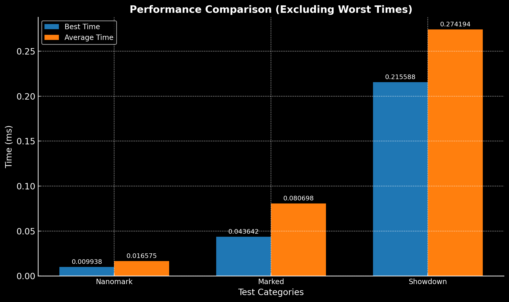

# Nanomark

**Nanomark** is a super-fast, lightweight Markdown-to-HTML parser. It supports common Markdown features and is designed for speed and simplicity.



## Features

- **Headings**: Convert `# Heading` to `<h1>Heading</h1>`.
- **Bold and Italic**: Transform `**bold**` and `*italic*` to `<strong>` and `<em>`.
- **Links**: Parse `[Link text](https://example.com)` to `<a href="https://example.com">Link text</a>`.
- **Lists**: Support for ordered (`1. Item`) and unordered (`- Item`) lists.
- **Blockquotes**: Render `> Blockquote` as `<blockquote>Blockquote</blockquote>`.
- **Inline Code**: Convert `` `code` `` to `<code>code</code>`.
- **Code Blocks**: Parse multi-line code blocks into `<pre><code>` elements.
- **Paragraphs**: Automatically wrap plain text in `<p>` tags.
- **Escaping**: Prevents HTML injection by escaping special characters.

## Installation

Install the package via npm:

```bash
npm install nanomark
```

## Usage

Here's how you can use `Nanomark` to parse Markdown into HTML:

```javascript
const Nanomark = require("nanomark");
const parser = new Nanomark();

const markdown = `
# Hello World

This is a **bold** and *italic* text.

- List item 1
- List item 2

1. Ordered item 1
2. Ordered item 2

> This is a blockquote

\`inline code\`

\`\`\`
code block
\`\`\`

[Link text](https://example.com)
`;

const html = parser.parse(markdown);
console.log(html);
```

### Output

```html
<h1>Hello World</h1>
<p>This is a <strong>bold</strong> and <em>italic</em> text.</p>
<ul>
  <li>List item 1</li>
  <li>List item 2</li>
</ul>
<ol>
  <li>Ordered item 1</li>
  <li>Ordered item 2</li>
</ol>
<blockquote>This is a blockquote</blockquote>
<code>inline code</code>
<pre><code>code block</code></pre>
<a href="https://example.com">Link text</a>
```

## Documentation

### The `Nanomark` Class

#### `new Nanomark()`

Create a new `Nanomark` parser.

#### `parse(markdown: string): string`

Convert a Markdown string to HTML.

- **`markdown`**: The Markdown string to parse.
- **Returns**: The HTML string.

## Performance

Nanomark pre-compiles regex patterns for peak parsing speed.

## License

This project is licensed under the MIT License. See the [LICENSE](./LICENSE) file for details.

## Contributing

Contributions are welcome! Please submit issues or pull requests to improve this project.

Happy coding with **Nanomark**!
